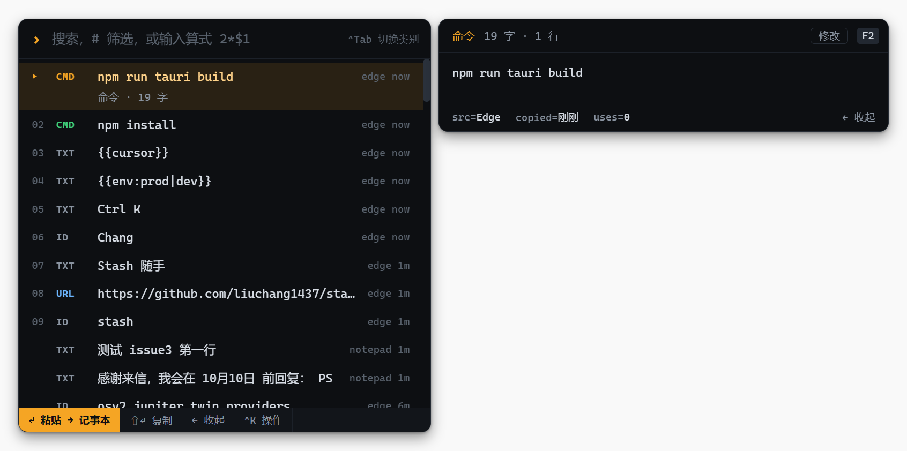

# Stash 随手

[English](README.md) | 简体中文

[](LICENSE)

[](https://tauri.app)

随手复制、随手存、随手取。Windows 上的剪贴板历史 + Snippets + 计算器启动器：一个快捷键唤出，选中后直接粘贴回你正在输入的程序。



## 亮点

- **一处搜索全部**：`Alt+Space` 弹出浮层，统一搜索剪贴板历史和 snippets，旁边直接显示选中项的预览
- **模糊匹配 + 拼音**：输入 `zb` 就能找到「周报」，按匹配度和使用频率 / 时间排序
- **粘贴回原处**：选中后自动切回原窗口并粘贴，可选粘贴后恢复原剪贴板
- **粘贴后换一条**：贴错了？按住 `Alt` 连按 `V` 原地换成更早的记录（类似 Emacs 的 yank-pop）
- **Snippets 是普通 `.md` 文件**：支持变量（填空、默认值、选项、日期、剪贴板历史、光标位置），变量直接在浮层里填，边填边看结果；目录放进 OneDrive 或 git 就能同步
- **搜索框就是计算器**：输入 `(1+2)*3^2` 直接出结果，`$1 + $2` 把最近复制的两个数相加
- **认得你复制的内容**：表格、命令、标识符、网址、Solana 地址各有对应的预览和操作，比如「粘贴为 JSON 字符串」「粘贴为 Markdown 表格」
- **数据只在本地**：不会主动联网，并遵守密码管理器设置的「不记录」标记

## 安装

系统要求：Windows 10 / 11（64 位），以及 Microsoft Edge WebView2 运行时（Windows 11 自带，缺少时安装程序会自动安装）。

1. 从 [Releases](https://github.com/liuchang1437/stash/releases) 下载最新的 `.exe`（NSIS）或 `.msi` 安装包
2. 运行安装。安装包暂时没有代码签名，SmartScreen 可能会拦截：点「更多信息 → 仍要运行」

也可以[从源码构建](#从源码构建)。

## 快速上手

1. 启动 Stash。它常驻在系统托盘，没有主窗口
2. 照常复制几样东西，然后在任意程序里按 `Alt+Space`
3. 输入关键字搜索，`↑ ↓` 选择，`↵` 粘贴回刚才的程序（`⇧↵` 只复制）
4. 按 `Ctrl N` 把选中的剪贴板记录存成 snippet，或者输入 `12*3` 试试计算器
5. 按 `Ctrl ,`（或在托盘菜单里）打开设置，可以修改快捷键、开机自动启动

其余内容见[使用说明](docs/guide.zh-CN.md)：全部快捷键、snippet 格式和变量、计算器、网址 snippet。

## 隐私与数据

- 剪贴板历史只保存在本地的 SQLite 文件里。Stash 不会主动联网，只在你要求时用浏览器打开网址
- 遵守其他程序设置的隐私标记（`ExcludeClipboardContentFromMonitorProcessing` / `CanIncludeInClipboardHistory`，1Password、KeePassXC 等会设置），带标记的内容不会被记录
- 可以按程序名忽略，托盘菜单可以暂停记录
- Stash 自己写入剪贴板的内容也带有排除标记，不会进入 Win+V 历史

| 内容 | 位置 |
|---|---|
| 设置 | `%APPDATA%\io.github.liuchang1437.stash\config.json` |
| 剪贴板历史 | `%APPDATA%\io.github.liuchang1437.stash\stash.db` |
| Snippets | `文档\Stash Snippets`（可在设置里修改） |

## 常见问题

**按 `Alt+Space` 没反应 / 打开了别的程序？**
多半是其他程序（比如 PowerToys Run）占用了同一个快捷键。打开设置，点一下快捷键输入框，直接按下新的组合键。

**浮层总在屏幕中间，能跟着输入光标出现吗？**
可以，在设置里打开「在输入光标旁边打开」。大多数编辑器、终端和浏览器都支持；找不到光标时会出现在鼠标旁边，标题栏提示「未找到光标」。

**怎么在多台电脑之间同步 snippets？**
在设置里把 Snippets 目录改到会同步的位置（OneDrive、坚果云、git 仓库……）。使用次数等统计存在本地数据库里，使用 snippet 不会修改文件，也不会触发同步。

**支持 macOS / Linux 吗？**
暂时不支持。系统相关的代码都集中在 `src-tauri/src/platform/`，移植是可行的，欢迎贡献。

**怎么卸载并清除所有数据？**
在 Windows「设置 → 应用」里卸载 Stash，然后删除 `%APPDATA%\io.github.liuchang1437.stash\`。Snippets 目录不会被动，不需要的话也一并删除。

## 从源码构建

需要 Node.js、Rust（MSVC 工具链）和 Visual Studio Build Tools（C++ 工作负载）。

```bash
npm install
npm run tauri dev
```

启动后在托盘里，按 `Alt+Space` 打开。构建安装包（输出到 `src-tauri/target/release/bundle/`）：

```bash
npm run tauri build
```

## 参与贡献

欢迎反馈问题、提建议和提交 PR，较大的改动请先开一个 [issue](https://github.com/liuchang1437/stash/issues) 讨论。开发环境、提交前的检查和项目结构见 [CONTRIBUTING.md](CONTRIBUTING.md)（英文）。

## 致谢

Stash 基于 [Tauri](https://tauri.app)、[Svelte](https://svelte.dev) 和 [CodeMirror](https://codemirror.net) 构建，模糊匹配用 [nucleo](https://github.com/helix-editor/nucleo)，拼音搜索用 [rust-pinyin](https://github.com/mozillazg/rust-pinyin)，存储用 [rusqlite](https://github.com/rusqlite/rusqlite) / SQLite，snippet 目录监听用 [notify](https://github.com/notify-rs/notify)，Win32 API 用 [windows-rs](https://github.com/microsoft/windows-rs)。

## 许可证

[MIT](LICENSE)
