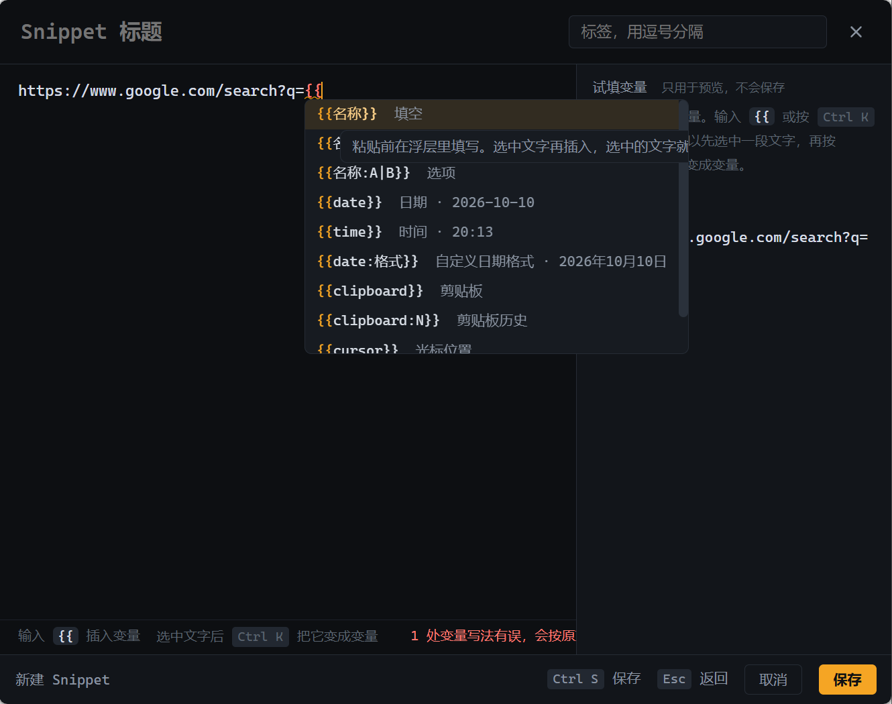

# Stash 使用说明

[English](guide.md) | 简体中文

安装和快速上手见 [README](../README.zh-CN.md)。

- [浮层](#浮层)
  - [粘贴后：换一条 / 撤销](#粘贴后换一条--撤销)
- [计算器](#计算器)
- [快捷键](#快捷键)
- [Snippet 格式](#snippet-格式)
  - [编辑 snippet](#编辑-snippet)
  - [网址 snippet（快捷搜索）](#网址-snippet快捷搜索)
- [设置](#设置)
- [从 Box 迁移](#从-box-迁移)

## 浮层

浮层出现在鼠标所在屏幕的中上方，列表和预览作为一个整体居中。设置里打开「在输入光标旁边打开」后改为贴着正在输入的位置出现（终端、编辑器、浏览器、飞书都可以），找不到光标时出现在鼠标旁边、标题栏提示「未找到光标」；下方空间不够时整个浮层翻到光标上方，输入框仍然挨着光标。

- `Ctrl Tab` 在「全部 → 剪贴板 → Snippets」之间切换类别，当前类别显示在输入框左边。输入 `#` 会列出可选的类别和 snippet 标签（`#clip` `#snip` `#pin` `#work`…），`↵` 选中，输完整名字后按空格也行；输入框为空时 `Backspace` 回到全部。剪贴板类别按「置顶 / 今天 / 昨天 / 更早」分组，Snippets 类别列出全部 snippet（包括没用过的）
- 匹配到的字会高亮，拼音匹配也会点亮对应的汉字（`zb` → **周报**）。匹配在正文里时，剪贴板记录直接显示匹配的那一行，snippet 在选中时把那一行显示在标题下面；预览里高亮所有出现的位置，并滚到第一处
- 选中的那一行下面会多一行摘要；侧边自动显示全文预览（左右哪边空间大放哪边，设置里可改成按 `→` 才展开），`←` 收起，表格默认排版显示，`Tab` 切换成原文
- snippet 的预览默认显示粘贴结果：日期、剪贴板已经代入，变量填好默认值，没有默认值的显示成 `‹名称›`，`{{cursor}}` 显示成一条竖线。要填的变量是绿色，自动取值的是蓝色（悬停可以看到来源）。`Tab` 切换成模板原文
- 选中带变量的 snippet 按 `↵`，变量就地展开：有选项的用数字键 `1–9` 或 `← →` 选，文本直接输入，`Tab` 下一项；侧边预览实时显示将要粘贴的内容，正在填的变量高亮
- 直接点进预览的正文（或按 `F2`）就能临时改动要粘贴的文字，光标落在点的位置，拖选的文字也会保持选中：剪贴板记录改的是全文，snippet 改的是粘贴结果（填变量时按 `F2` 就带上已经填好的值）。`Ctrl ↵` 粘贴，`Ctrl ⇧ ↵` 复制，`Esc` 放弃修改。原来的记录和 snippet 文件都不变，改过的文字也不会进剪贴板历史
- `Ctrl K` 打开操作菜单，带子菜单的项高亮时子菜单直接展开，`→` 进入。「粘贴为…」可以把内容转成单行、加引号、JSON 字符串、Markdown 表格；Solana 地址还能缩写成 `3wCv…ijkL` 或 `pubkey!("…")`，`Ctrl ↵` 在 Solscan 打开
- 自动识别内容类型（表格、命令、标识符、Solana 地址、网址…），预览和 `Ctrl K` 里的操作会随类型变化
- `Alt 1–9` 直接粘贴第 N 条
- 打开时输入法自动切到英文模式（搜索支持拼音，`Shift` 可切回中文），设置里可以关闭

后出现的面板不会挤动已经显示的面板：预览固定在列表旁边，操作菜单依次找预览旁的空位、预览外侧、列表另一侧，都放不下才叠在预览上。

光标位置依次尝试 Win32 caret、MSAA（Chromium / Electron）和 UI Automation（Windows Terminal 这类只支持基础 TextPattern 的程序用选区定位光标）。

### 粘贴后：换一条 / 撤销

粘贴后，刚粘贴的文字旁边（找不到光标时在鼠标旁边）会出现一个几秒钟的小提示条，它不抢焦点，可以继续打字。

- 按住 `Alt` 连按 `V`，提示条依次显示更早的记录，松开 `Alt` 就把刚才粘贴的内容原地替换掉（类似 Emacs 的 yank-pop）
- 点提示条上的「撤销」删掉刚粘贴的内容

替换靠「Shift+← 选中刚粘贴的文字再粘贴」实现，终端里改用退格键删除。终端里只会换成单行内容，超过 2000 字的内容不参与替换。快捷键可在设置里改或关闭（只在提示条出现时注册，平时不占用 `Alt+V`）。

## 计算器

在搜索框里直接输入算式，结果会作为第一条出现，`↵` 粘贴结果，`⇧↵` 只复制。`Tab` 在三种粘贴格式间切换：原始数字、千分位、`算式 = 结果`。

| 写法 | 示例 |
|---|---|
| `+ - * / ^`、括号、`1e3`、`1_000`、千分位 `1,234,567.8` | `(1+2)*3^2` → 27，`1,200*3` → 3600 |
| `%` 取模、`!` 阶乘 | `10 % 3` → 1，`-7 % 3` → 2，`5!` → 120 |
| `$N` 剪贴板历史倒数第 N 条（1 = 最近） | 先复制 12 再复制 30，`$1+$2` → 42 |
| 函数 `sqrt cbrt abs sin cos tan asin acos atan ln log log2 exp floor ceil round` | `sqrt 2`、`log(1000)` |
| 常量 `pi π e tau`，角度 `deg` | `2pi`、`sin(30deg)` → 0.5 |
| 全角符号 | `（１＋２）×３÷２` → 4.5 |

只有包含运算符或函数时才算作计算，所以搜 `e`、`2024` 这类普通关键词不受影响。三角函数默认用弧度。

千分位逗号（含全角 `，`）必须在标准位置：整数部分首组 1–3 位、其后每组 3 位。`1,23` 这类写法不会被当成 123，而是不显示结果。结果最多保留约 15 位有效数字，避免浮点误差露出来。

`$N` 引用的剪贴板内容会按数字读取，允许千分位逗号、空格、货币符号（`¥ $ € £`）、全角数字，以及结尾的 `%`（`15%` 读作 0.15）。如果引用的内容不是数字，就不显示计算结果。预览里会显示代入后的算式，方便核对取到的是哪个数。

## 快捷键

| 键 | 作用 |
|---|---|
| `↵` / `⇧↵` | 粘贴 / 仅复制 |
| `Ctrl ↵` | 用默认浏览器打开（网址），Solana 地址 / 交易签名在 Solscan 打开 |
| `↑ ↓`、`Ctrl J`、`PageUp/PageDown` | 选择（预览展开时翻页滚动预览） |
| `Alt 1–9` | 直接粘贴第 N 条 |
| `→` / `←` | 展开 / 收起侧边预览（搜索框光标在末尾 / 开头时） |
| `Tab` | 计算结果换格式；预览里切换排版 / 原文 |
| `F2` / 点预览正文 | 在预览里临时修改要粘贴的文字（`Ctrl ↵` 粘贴，`Ctrl ⇧ ↵` 复制，`Esc` 放弃） |
| `Ctrl Tab` / `Ctrl ⇧ Tab` | 切换类别：全部 / 剪贴板 / Snippets |
| `#` | 按类别或 snippet 标签筛选 |
| `Ctrl K` | 操作菜单 |
| `Ctrl P` | 置顶 / 取消置顶剪贴板记录 |
| `Ctrl N` | 新建 snippet（选中剪贴板记录时以其内容为初稿） |
| `Ctrl E` | 编辑 snippet |
| `Ctrl D` | 删除（snippet 需按两次确认） |
| `Ctrl ,` | 设置 |
| `Esc` | 清空搜索 / 回到全部 / 返回 / 隐藏 |

关闭后 60 秒内（可在设置里修改，0 表示不保留）重新打开，会保留上次的搜索内容并全选，直接输入即可替换；结果会重新计算，所以 `$1` 这类引用会用到最新的剪贴板。

## Snippet 格式

默认目录 `文档\Stash Snippets`，每个 snippet 一个文件：

```markdown
---
title: 周报
tags: [work]
---
本周（{{date:MM-dd}}）完成：
- {{cursor}}

下周计划：{{plan}}
```

| 变量 | 含义 |
|---|---|
| `{{name}}` `{{name=默认值}}` `{{env:prod\|dev}}` | 粘贴前在浮层里填写（文本 / 带默认值 / 选项） |
| `{{date}}` `{{time}}` `{{datetime}}` `{{date:yyyy年MM月dd日}}` | 当前时间，支持 `yyyy yy MM dd HH hh mm ss` |
| `{{clipboard}}` | 当前剪贴板文本 |
| `{{clipboard:N}}` | 剪贴板历史中倒数第 N 条（1 = 最近一条）；依次复制 A、B、C 后，`{{clipboard:3}}` 是 A |
| `{{uuid}}` | 随机 UUID |
| `{{cursor}}` | 粘贴后光标停留的位置 |

### 编辑 snippet

浮层里 `Ctrl N` 新建、`Ctrl E` 编辑，不用记上面的写法：



- 输入 `{{` 会列出所有变量，附带现在的取值（比如今天的日期），选一个直接插入，`Tab` 在变量名、选项之间跳
- 先写好一段真实的内容，选中要变的部分（比如人名）按 `Ctrl K`，选「填空」就变成 `{{名称=张三}}`，选中的文字成为默认值，再起个名字就行；也可以换成选项、日期、剪贴板等。没有选中时 `Ctrl K` 在光标处插入
- 变量按类型着色，写法有误的（比如变量名带空格）标红，悬停可以看到原因，这些会按原文粘贴出去
- 右边列出粘贴时要填的变量，可以试填，下面实时显示粘贴结果

### 网址 snippet（快捷搜索）

内容是网址的 snippet 可以按 `Ctrl ↵` 在浏览器打开，变量照常先在浮层里填写：

```markdown
---
title: 百度搜索
---
https://www.baidu.com/s?wd={{关键词}}
```

用浏览器打开时，网址里的变量值会自动做 URL 编码，中文、空格、`&` 都能正确传递；粘贴时则保持原样。如果整个网址本身就是一个变量（`{{url}}`），它的值不会被编码。只允许打开 `http`、`https` 和 `www.` 开头的地址。

使用次数等统计存在本地数据库而不是 snippet 文件里，所以使用 snippet 不会触发同步。

## 设置

按 `Ctrl ,` 或在托盘菜单里打开设置，可以修改：

- 界面语言：跟随系统（默认；Windows 显示语言是中文时用中文，否则用英文）、中文或 English
- 唤起快捷键（默认 `Alt+Space`）和粘贴后「换一条」的快捷键（默认 `Alt+V`，可关闭）
- 在输入光标旁边打开、打开时自动展开预览、打开时切换到英文输入
- 浮层里列表和预览的宽度（默认 440 和 480 px）
- Snippets 目录（默认 `文档\Stash Snippets`）
- 剪贴板历史保留条数（默认 5000，置顶的记录不计入，也不会被自动清理）
- 不记录哪些程序的复制（默认忽略 1Password、KeePass、KeePassXC、Bitwarden）
- 关闭后保留搜索内容的秒数（默认 60）
- 粘贴后恢复原来的剪贴板内容、开机自动启动

托盘菜单还可以暂停记录剪贴板、打开 Snippets 目录。

## 从 Box 迁移

本项目早期名为 Box。首次以 Stash 启动时，会把 `%APPDATA%\com.box.app` 和 `文档\Box Snippets` 自动搬到新位置（新位置已存在时不动）。
